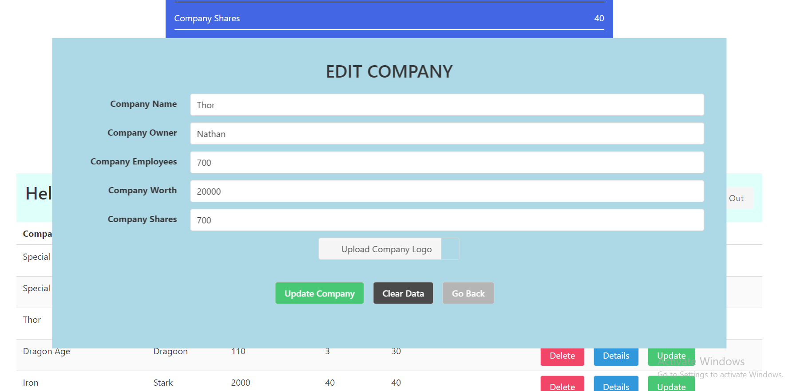

# A Mini Company Management App created in Django integrated with React.

A Company Management App which could serve as a boilerplate for a Django + React app. It has simple functionality of
adding a company with various parameters like company name, employees working in the company, turn over and more. The system
is a multi-user system with Token based authentication implemented in Django using rest framework.

The Project is integrated with React from scratch without using React cli tools so that it gives me more customized
controls over settings, output files, scripts to run and more.

## Getting Started

* Initialize the root project folder as an NPM repository, create a Django project inside it. Use package.json files
to install NPM packages required for React. The Frontend code is actually written inside a Django app, code is
outsourced after compilation into templates directory inside this application.

* Use requirements.txt file to install the python and Django related dependencies.

## Built With

* [Django - A Progressive Web Framework](https://www.djangoproject.com/)
* [Django Rest Framework](https://www.django-rest-framework.org/)
* [React JS](https://reactjs.org/)
* [React Redux](https://redux.js.org/)
* [Bulma CSS](https://bulma.io/)
* [HTML + CSS + SCSS](https://www.w3schools.com/html/html_css.asp)

## Authors

* **Amit Prafulla (APFirebolt)** - (http://amitprafull.com/)

## License

This project is licensed under the MIT License - see the [LICENSE.md](LICENSE.md) file for details

## Screenshots

Please find some of the screenshots of the application. Below is the screenshot of the main registration page.

Adding a company page which opens a modal.

Dashboard Page which would list all the companies added by the logged in user.

Edit company modal, is just the same modal which is used for adding and editing companies based on 'Add' or 'Edit' mode.

Details page of a company, company details would be displayed at the top of the page. Just a simple design can be
tweaked to make it look more aesthetic :)

